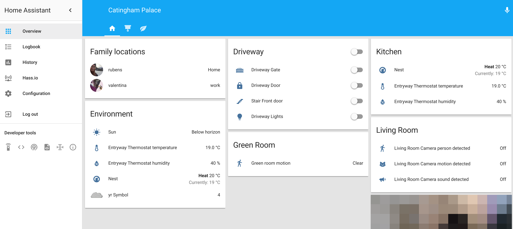

# Home Assistant configuration

This is my current [Home Assistant](https://home-assistant.io/) configuration files used inside my house.

I'm automatically testing them against the last HA release using TravisCI

At the moment I'm successfully running Home Assistant on a [RaspberryPI 3 model B](https://goo.gl/pBDyFJ).

